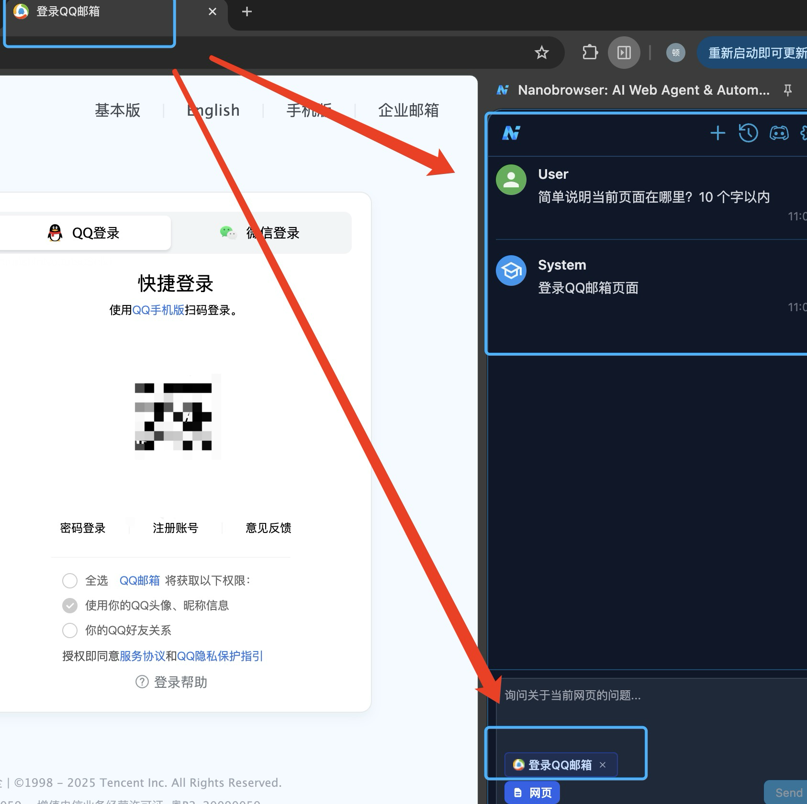
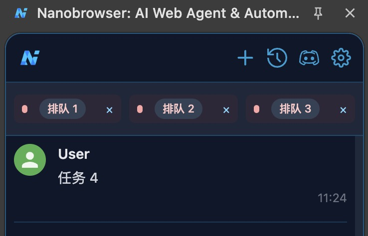
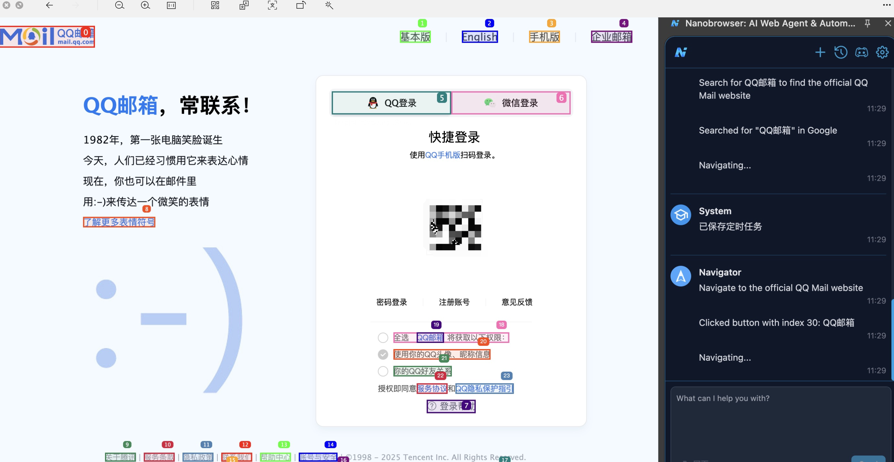
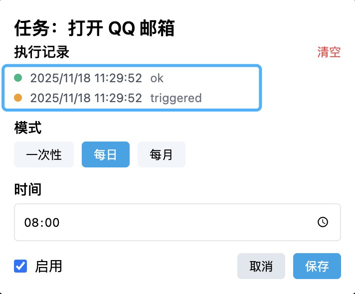
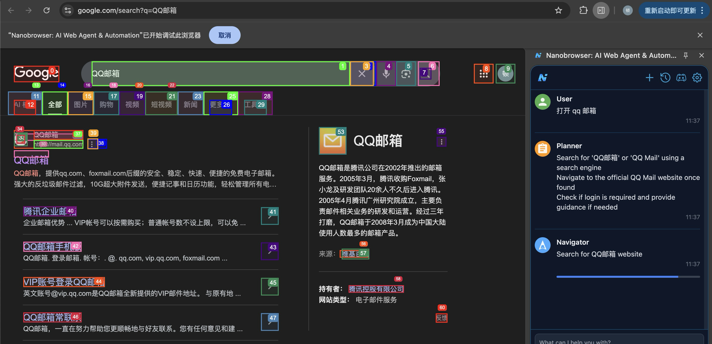
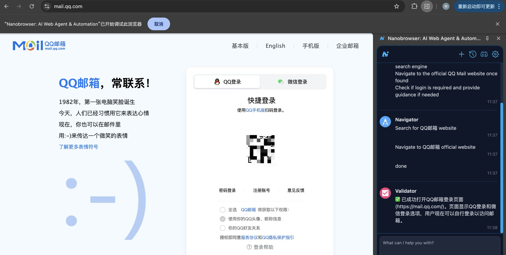
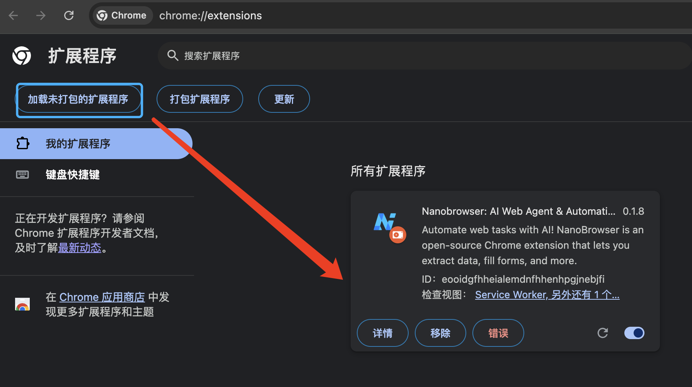

# MsyBrowser
1. 当前demo项目的目标：一句话完成一件任务

2. 当前项目为已生成的浏览器扩展包的形式，直接浏览器加载扩展包即可使用，如需完整项目可参考原项目 https://github.com/nanobrowser/nanobrowser

3. 类似项目的初始核心都是借鉴 Browser-use 的思路，地址: https://github.com/browser-use/browser-use

4. 新增功能：网页智能问答,可以对当前所在网页进行智能问答

   

5. 新增功能: 任务排队功能(最多 3 个排队任务，超过会进行提示)

   

   

6. 新增功能: 定时执行(一般设置到分钟，延迟 20s 左右进行执行，显示需要重新设置并点取消才会显示定时任务;执行完后可以查看执行历史)

   

   

   

   

   

   

7. 正常使用流程显示：

   

   

8. 当前使用浏览器版本为:  版本 140.0.7339.214（正式版本） (arm64)

9. 安装扩展(在浏览器有谷歌，edge 等，详情见原项目)，输入: chrome://extensions/,加载 dist 文件(需要解压)

   

10. 待完成功能(随缘更新): 历史任务执行记录保存成 GIF 图功能，参考 web-ui中历史记录功能 ：https://github.com/browser-use/web-ui

11. 为每个不同的任务配置合适，任务完成率高的任务 prompt

12. 本地适配项目修改内容还有很多，基本去除了 Nanobrowser 相关标识，鉴于种种原因，此版本仅保留核心新增功能

